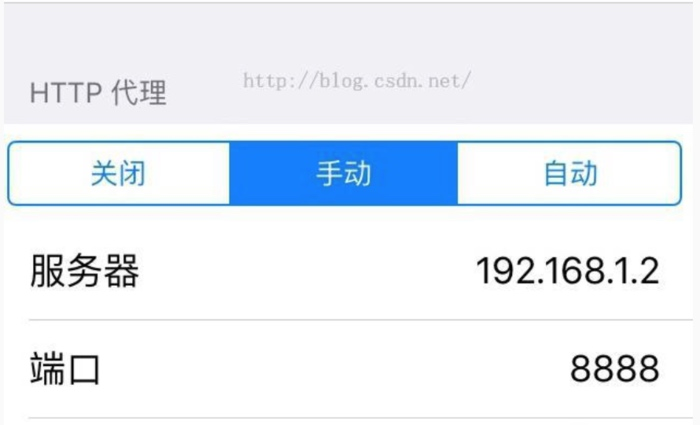
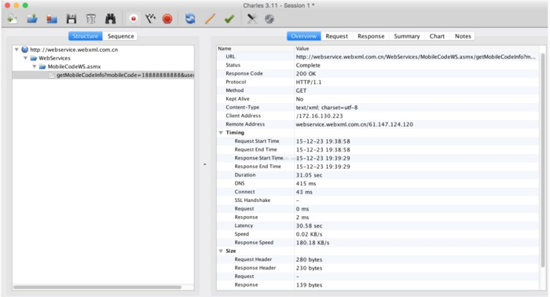
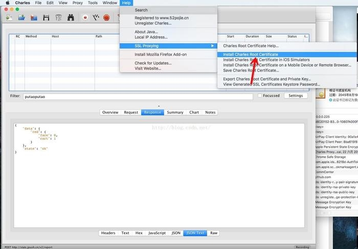
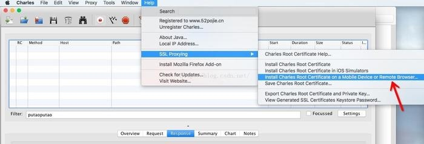
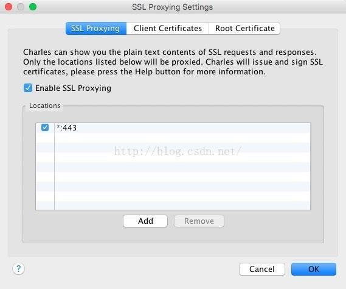

# Charles4.0.1 破解版安装使用

Charles 下载
百度盘下载: https://pan.baidu.com/s/1bVGcVG
提取码:23hy
 
一、安装Charles
破解教程:
1.打开dmg镜像，将“Charles.app”拖入应用程序中；

2.打开应用程序—右键“Charles.app”显示包内容—Contents—Java

3.将dmg镜像包内的“charles.jar”替换覆盖到第

二步的Java文件夹中；

4.打开“Charles.app”，等待30秒，菜单栏中找到“Help”—“Register…”，输入任意信息完成注
册；

5.Have done！

二、使用
1.http抓包
1.1 现在我们默认是在进行iOS开发，首先确保iPhone和Mac是在同一个局域网下（连同一个WiFi）。然后查看Mac的IP地址（打开网络偏好设置即可看到），假设我的IP地址为：192.168.1.2. 然后进入iPhone，进行HTTP代理设置，从关闭改为手动，在服务器位置输入刚才Mac的IP地址。在端口位置输入8888.如图：
 
1.2 然后就可以开始进行抓包了。打开Charles，会弹出是否允许，选择Allow即可。然后在iPhone上打开你要抓包的App，在Charles上就会看到抓包结果：

2.https抓包
由于需要抓https包，看到网上说的挺简单的，然后按照说明配置了一下，结果不行，然后整个人都方了
首先先来看电脑如何配置：

电脑需要先安装证书，而且还需要一直信任才可以
必须为加号，不能为红色的叉，否则是不行的

电脑安装完了，然后需要手机安装，这里需要如此如此。。。。

点击后出来一下弹窗，然后需要在收的浏览器输入相应地址，需要先把代理设置好

然后开始配置ssl

*：443就可以了
2.3 经过以上步骤，就可以进行Https抓包了。其他操作过程同http抓包。
注意：当你抓包结束后，就要去iPhone里把网络的HTTP代理关闭，否则可能会造成无法上网的情况。

三、抓包结果详解
3.1 http抓包结果
如果按照上面的过程配置好后，在手机上使用任意应用请求网络后（注意一定要用真机才可以），就会得到http请求的抓包结果，如下图：
 
左侧是显示结构：Structure是树状结构显示，Sequence是水平结构显示。两者基本类似，我以树状结构来进行介绍。左侧的树状结构是我进行网络请求的url链接，每一个层级表示了以“/”隔开的子域名。通过上述的代码也可以看到我GET请求的url链接是：
https://api.maoyan.com/mmdb/search/movie/hotmovie/list.json
右侧是详情页，其中第一个Overview是概览。我对一些字段进行介绍：
（1）URL：我进行网络请求的链接；
（2）Status：当前状态，complete表示请求完成；
（3）Responce Code：返回码。不同的接口，不同的请求结果，返回码都不同；
（4）Protocol：使用的协议；
（5）Method：请求方式，如GET请求，POST请求等；
（6）Kept Alive：判断当前是否正在链接（活跃）；
（7）Content-Type:发送的内容类型，如这里用的是XML文本，以UTF8的方式发送；
（8）Client Address：客户端的IP地址；
（9）Remote Address：远程服务器的IP；
Timing:
（10）Request Start Time：请求开始的时间；
（11）Request End Time：请求结束的时间；
（12）Response Start Time：返回开始的时间；
（13）Response End Time:返回结束的时间；
Size:
（14）Request Header ：请求的头部大小；
（15）Request Header：返回的头部大小；
（16）Request : 请求发送的大小；
（17）Response：返回数据的大小；
（18）Total：所有数据大小；
（19）Request Compression :请求压缩；
（20）Response Compression: 返回压缩；

第二个页面"Request"是关于请求发送的。下面的Headers，Query String,Raw。
（1）Headers：发送请求的头部信息；
（2）Query String:发送参数列表；
（3）Raw：发送的原生数据，包括了头部和参数；

右侧的"Response"的是关于所有返回信息的。
（1）Headers：是返回的头部信息；
（2）Text：返回信息（除去头部）后的文本；
（3）Hex：返回信息的16进制表示；
（4）XML：我返回的数据是XML。如果你返回的是JSON，这里就会显示JSON；
（5）XML Text：如果你返回JSON，这里会显示JSON Text；
（6）Raw：返回的所有原生数据，包括头部；

"Summary"里面是发送数据的一些简要信息。
"Chart"是一些简要信息的图表表示。

Charles顶部的一些常用的工具栏做一个介绍：
（1）New Session：新建一个会话。也就是在一个新的Charles界面查看网络情况；
（2）Open Session:打开一个之前保存的会话；
（3）Close the current Session:关闭当前的会话；
（4）Save the current Session:保存当前的会话；
（5）Clear the current Session:清空当前的会话（比较方便，常用）；
（6）Find Text in the current session:相当于查找功能；

3.2 https抓包结果
由于目前iOS9更改了对于https网络的安全机制，所以还需要在iPhone上安装一个证书，安装方式如下：
在iPhone的Safari浏览器中直接输入网址：http://www.charlesproxy.com/getssl 。进行安装Custom Root证书.安装完成之后可以进入设置-->通用-->描述文件，里面可以看到你所有安装的证书。到目前为止，对于https抓包，至少已经安装了两个证书了，第一个也就是在前面安装的。
现在打开iPhone的任意一个App，查看抓包结果：
 
其中http打头的都是通过http抓包生成的；https打头的则是通过https抓包生成的。如果你没有配置好https抓包，那么https前面的是一把锁，抓包成功的才是显示蓝色小球。
某一个https抓包结果如下：一些关于使用方式、参数的介绍同http抓包。

